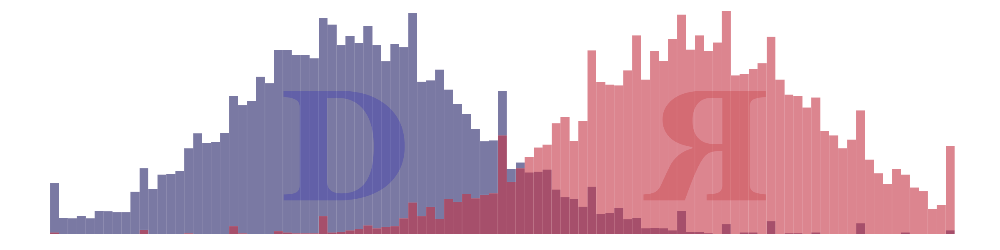

<!-- README.md is generated from README.Rmd. Please edit that file -->

# utnac

Notes and links recorded during the 2018 New Agendas in Communication, *Conservatively speaking: How right-wing media and messaging (re)made American politics*, confernce at the University of Texas.

## Keynote

**Speaker**

+ Jenifer Sarver, Republican candidate for U.S. Congress TX-21

**Title**

+ *The GOP: Then and now -- A conversation with Jennifer Sarver*

**Highlights**

+ Unhappy with recent trends in Republican party, most especially Trump
+ Believes Republican party should return to limited government, local control, and restrained spending
+ Conservative candidates flock to topics/views that get big applause lines (e.g., protecting Texas voters from Shria law) instead of the important issues (e.g., opioid)
+ Polarized electorate---there is nothing the Mueller investigation could find that change the mind of 37% of voters who support Trump
+ Too many conservatives consume news from a single source, Fox News, which drives most conversations
+ Not a fan of telivised news (it's just a contest to say the most outlandish and far-right things) 
+ Prefer to read the news and to search for new and diverse sources
+ Pro-life conservatives should actually talk about ways to reduce abortions (contraceptives, etc.)
+ Disagrees with traditional family value Republicans on the subject of the role of women in politics
+ Interested to know more about the role of bots on social media---conservatives don't seem willing to admit they retweeted things from Russian bots

## Session 1
+ **Facilitator**: Delaney Harness
   - Affiliation: University of Texas at Austin

#### Matt Grossman
+ Affiliation: Michigan State University & David Hopkins, Boston College

#### Nicole Hemmer
+ Affiliation: University of Virginia

#### Michael Lee
+ Affiliation: University of Charleston

